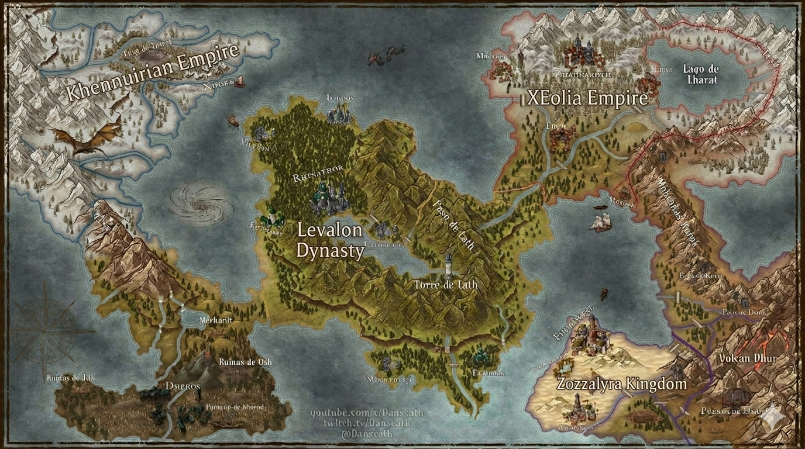

# Aethelgard-Pathfinder-World

Welcome to Aethelgard 🌌, a world where the very air you breathe is saturated with magic and the ground beneath your feet is the third planet in its solar system. This is a realm where divinity isn't just a myth—it's an evolution.

In Aethelgard, magic ✨ is as natural as a heartbeat. It flows through the mountains of the Khennuirian Empire, the dense forests of the Levalon Dynasty, and even the scorching sands of the Zozzalyra Kingdom. Looking up at night, the sky is dominated by three distinct moons 🌕🌕🌕, each likely tugging at the magical tides of the world.

The gods 👑 of this world are not distant, unknowable spirits. They were once living creatures—perhaps heroes, monsters, or scholars—who amassed enough power or influence to transcend their mortal shells. Alongside these ascended beings, the established Pathfinder deities also hold sway, creating a complex web of faith and power.

